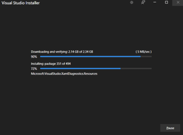
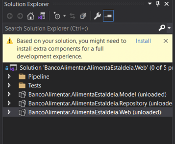
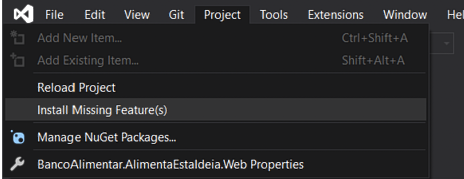
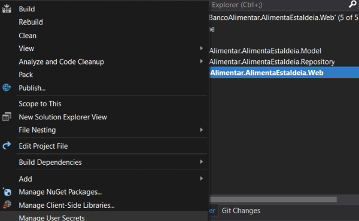
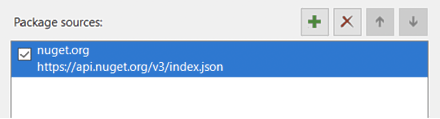
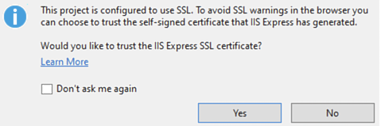
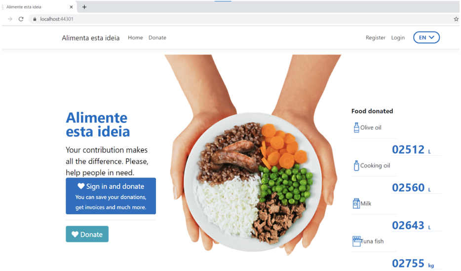

# Setting up a local development environment on a Windows machine

## Table of contents:
- [Installation](#installation)
    - [Prerequisites](#prerequisites)
    - [Visual Studio](#visual-studio)
    - [Installation using choco](#installation-using-choco)
- [Setup](#setup)
    - [Cloning the project](#cloning-the-project)
    - [Configuring secrets](#configuring-secrets)
    - [Adding package source](#adding-package-source)
    - [Whitelisting IP](#whitelisting-ip)
    - [Running from Visual Studio](#running-from-visual-studio)
    - [Running from terminal](#running-from-terminal)
- [Environments](#environments)
    - [DeploymentSlots](#deployment-slots)

## Installation

### Prerequisites

- Git (<https://git-scm.com/download/win>)
- Github account

### Visual Studio

Download and install Visual Studio from <https://visualstudio.microsoft.com/downloads>



## Installation using choco

By default you install it from Powershell as admin, but non-admin is also possible for advanced users (<https://docs.chocolatey.org/en-us/choco/setup#non-administrative-install>).

1. Install choco from Powershell (<https://docs.chocolatey.org/en-us/choco/setup>)

    ```powershell
    Set-ExecutionPolicy Bypass -Scope Process -Force; [System.Net.ServicePointManager]::SecurityProtocol = [System.Net.ServicePointManager]::SecurityProtocol -bor 3072; iex ((New-Object System.Net.WebClient).DownloadString('https://chocolatey.org/install.ps1'))
    ```

2. Install the following packages (skip git if you have it already)

    ```powershell
    choco install git -y
    choco install visualstudio2019community -y
    ```

## Setup

### Cloning the project

1. Provide your github username to code owners and ask them to add you to the organization and give you write permissions to the repo

2. Clone the project

    ```
    git clone git@github.com:banco-alimentar/alimentestaideia.pt.git
    ```

### Installing additional components

1. Open Visual Studio. When you do it for the first time, you will be asked to sign in to Visual Studio - you can do it or skip - whatever you prefer

2. You can clone now (`Clone a repository`) or - if you cloned alredy - choose `Open a local folder` and navigate to your repo folder.

3. If you've just installed git, you might be prompted by Visual Studio to configure your git user name and email address. If not, please do it yourself using terminal

    ```
    git config --global user.name "Your Name"
    git config --global user.email "your@email.com"
    ```

4. After you open the repo, you may see message about missing extra components. Click `Install`

    

    If it's not there, you might find it in `Project` menu

    

    Install the components proposed by Visual Studio.

    

5. Right click `BancoAlimentar.AlimentaEstaIdeia.Web` in `Solution Explorer` window and choose `Set as Startup Project` or simply double click `BancoAlimentar.AlimentaEstaIdeia.Web.sln`

      - Solution Explorer should be on the right hand side, if you only see `Git changes`, look at tabs on the bottom to switch to `Solution Explorer`

3. Proceed with installation. You may need to restart Visual Studio

### Configuring secrets

1. If you received secrets via email, copy the part between curly braces `{...}` (make sure to inluce the braces)

2. Right click on `BancoAlimentar.AlimentaEstaIdeia.Web` and then `Manage User Secrets`

      

3. Paste the contents of your clipboard into the file editor that opened as a result of clicking on `Manage User Secrets`

      Now, Gmail might have removed some quotes around email addresses and urls, and now json file is not well formed - you will get an error if you try to import credentials.

      You you need to restore quotes manually. Put quotes around values that don't have them, excluding only `true/false` values.

      For instance:

      - is: `"Smtp:User": alimentestaideia.dev@outlook.com,`
      - should be: `"Smtp:User": "alimentestaideia.dev@outlook.com",`

      After that, you can save and close the secrets file.

### Adding package source

At this point in `Error List` window you might see many messages about packages missing. In order to download them to local package cache, you need to enable `nuget.org` as a package source.

1. Right click on `BancoAlimentar.AlimentaEstaIdeia.Web` and then `Manage NuGet Packages...`

2. Click the `gears icon` on the right hand side of the window to display the options (alternatively from the main menu: `Tools -> Options`)

3. Click on `General` under `NuGet Package Manager` and make sure option `Allow NuGet to download missing packages` is checked.

3. Click on `Package Sources` under `NuGet Package Manager` and click `"green plus"` icon and add a new source like shown on the screenshot below, and click `Update`. Alternatively run from terminal: `dotnet nuget add source https://api.nuget.org/v3/index.json -n nuget.org`

      

      The packages will start to be downloaded after you click OK, or on build.

### Whitelisting IP

Ask code owners to whitelist your public IP, so that you can connect with SQL database.

### Running from Visual Studio

1. In the solution tree view on the right you should see `BancoAlimentar.AlimentaEstaIdeia.Web` in bold. If you don't, navigate to file `BancoAlimentar.AlimentaEstaIdeia.Web.sln` and double click it, or right click `BancoAlimentar.AlimentaEstaIdeia.Web` and choose `Set as Startup Project`

2. Rigth click `BancoAlimentar.AlimentaEstaIdeia.Web` and press `Build`. You should see a lot of messages in console output, but no Errors until now.

      If there are any errors, please read them and revisit previous points if necessary (NuGet packages, Secrets)


3. Navigate to the top and press `play` icon. You might see the prompt to trust SSL certificate.

   

4. If everything goes well, your web browser should pop up and display project site.

      

5. Congratulations! You've made it! You can code now and test in your local environment.

### Running from terminal

Alternatively you can run project from command line.

```
cd BancoAlimentar.AlimentaEstaIdeia.Web
dotnet run
```

From the following messages you will see which port is open (most probably `https://localhost:5001`), but when you open it like this, certificate might be not trusted and you need to go to `Advanced -> Proceed...` for the first time.

## Environments 

![Environments]Our available environments are:

1. Development: https://alimentaestaideia-developer.azurewebsites.net

2. Pre-Production: https://alimentaestaideia-preprod.azurewebsites.net

3. Production: https://alimentestaideia.pt

### Deployment Slots

