# PAYMENTS - How to Test while Developing

## Table of Contents
- [Payment Process Steps](#payment-process-steps)
    - [Step 1](#step-1)
    - [Step 2](#step-2)
    - [Step 3](#step-3)
    - [Step 4](#step-4)
    - [Step 5](#step-5)
    - [Step 6](#step-6)
    - [Step 7](#step-7)
    - [Step 8](#step-8)
    - [Step 9](#step-9)
    - [Step 10](#step-10)
    - [Step 11](#step-11)
    - [Step 12](#step-12)
- [Managing Payments](#managing-payments)

## Payment Process Steps

``Donations can be done by authenticated users and unauthenticated ones. For authenticated user some information will be filled according to user's data provided during the registration processo.``

## Step 1

1. Click on "Donate".

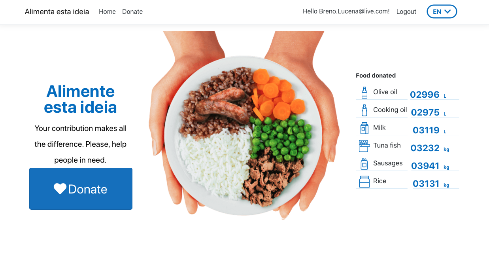

## Step 2

2. Select products you want to donate, and the food bank destination. 

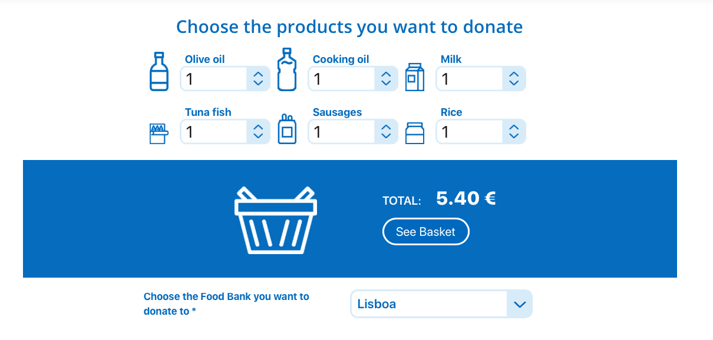

## Step 3

### Basic Information

3. Fill in your basic information.

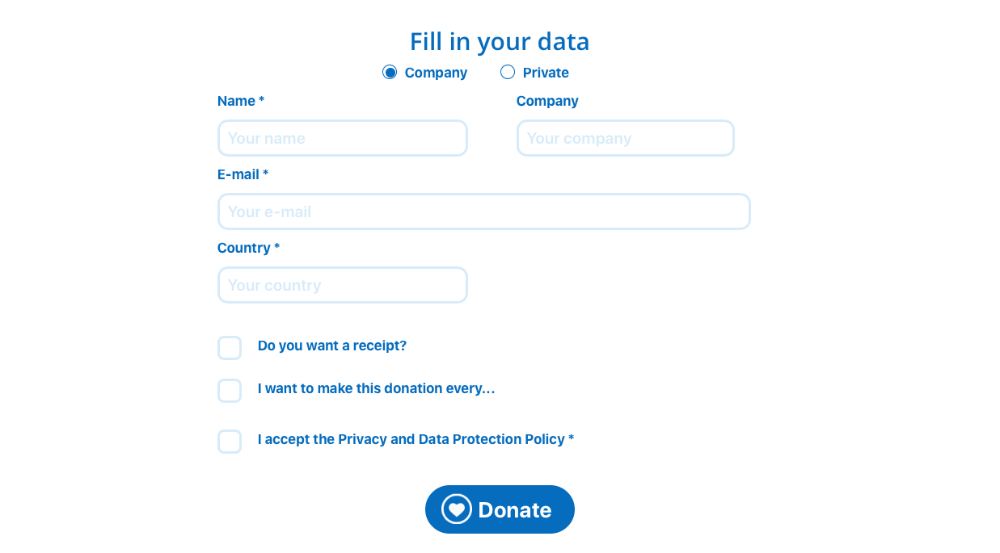

## Step 4

### VAT Receipt

4. Check the "The do you want a receipt?" if you will need the VAT receipt, and fill in the required data. 

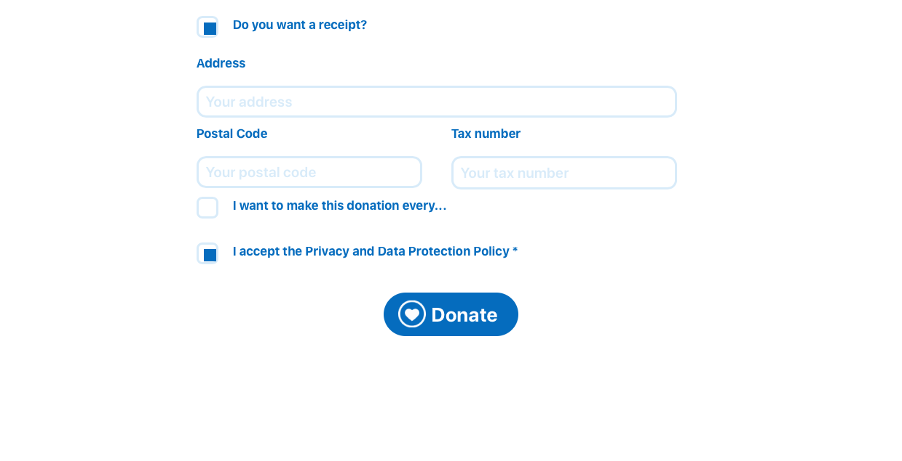

## Step 5

### Recurrent Donations

5. Check the "I want to make this evevery..." if you want to create a recurrent donation, and select the periodicity. The click donate to continue.

## Step 6

### Payment Method Selection

6. Select your payment metho by clicking on the repective icon (Multibanco, Credit Card, PayPal and MBWay).

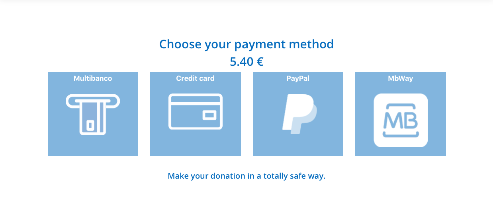

## Step 7

### Multibanco

7. If "Multibanco" was selected, click on the "Multibanco Payment" button to continue.

``After request a Multibanco payment, send an email to:``

* tiago.andradesilva@bancoalimentar.pt

``He will proceed with the the requested operation.``

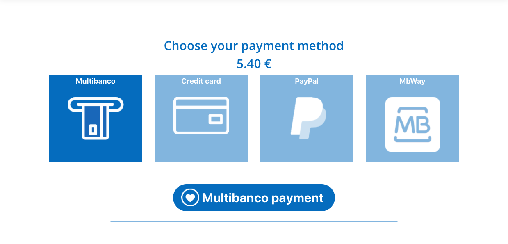

* Clicking 'Multibanco Payment' button will generate and present on screen a Multibanco reference to be used for payment.

## Step 8

### Credit Card

8. If "Credit Card" was selected, click on the "Visa Payment" button to continue.

``Use the EasyPay options for test purposes related to payment success, error, or refused.``

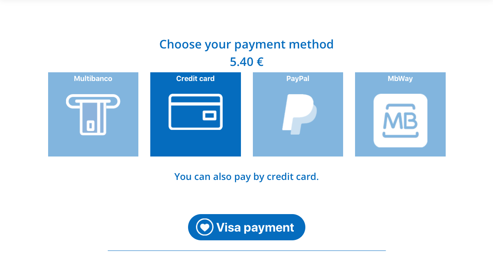

* EasyPay Form

* EasyPay Form with Test Payment Options

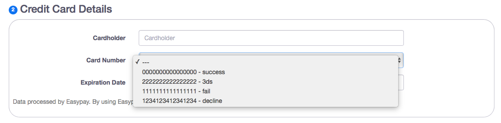

## Step 9

### PayPal

9. If "PayPal" was selected, click on the "PayPal Payment" button to continue.

``For PayPal development, debug and test purposes, use the following``

* ``username: sb-xkcxs2177214@personal.example.com``
* ``password: CM891Yg#``

## Step 10

### MBWay

10. If "MBWay" was selected, fill in the "Phone Number" field, and then click "MBWay" button.

``For MBWay debug, development, and test purposes, use the following phone numbers according to the expected outcome:``

* ``For MBWAY_AUTHORIZED_ALL    --> 911234567``
* ``For MBWAY_FAILED_ALL        --> 917654321``
* ``For MBWAY_DECLINED_ALL      --> 913456789``
* ``For MBWAY_PENDING_ALL       --> 919876543``

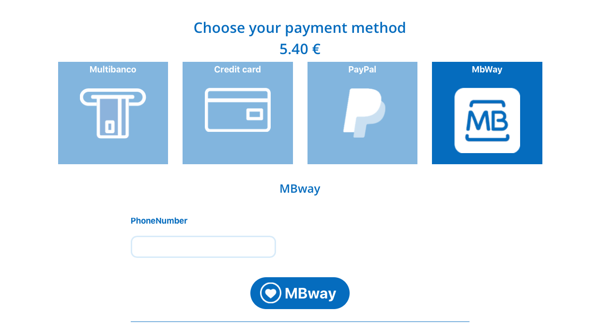

## Step 11

### Donation Processed

11. After your selected payment method being processed you will receive the following processed screen.

## Step 12

### Thank You Message

12. Right after the processed screen, you will see the "Thank You" message screen.

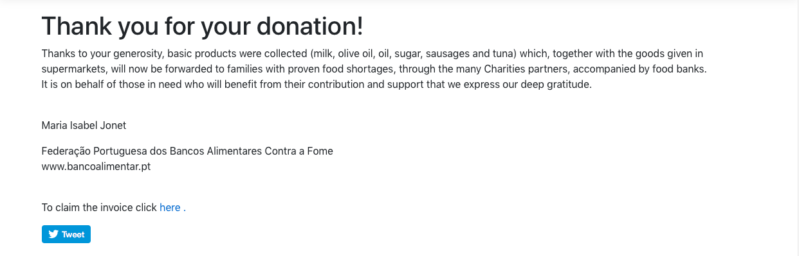

## Managing Payments

Use the "Donation History" section to manager your donations and payments.

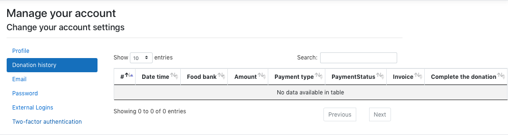