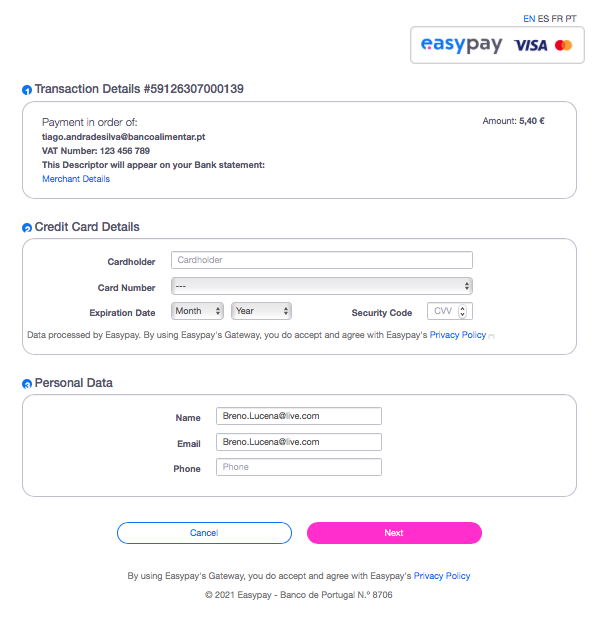

# PAYMENTS - How to Test while Developing

## Table of Contents
[Item1](#item1)
[Item1Subitem1](#item1subitem1)

## Payment Basic Process Steps

* Donations can be done by authenticated users and unauthenticated ones.

### For Unauthenticated Users

1. Click on Donate button located on landing page.

2. Select what you want to donate and for which food bank you want to send it.

[image]

3. Fill up your doner basic data.

[image]

#### Without Receipt and not Recurrent

[image]

#### With Receipt and not Recurrent

[image]

#### With Receipt and recurrent

[image]

### For Authenticated Users