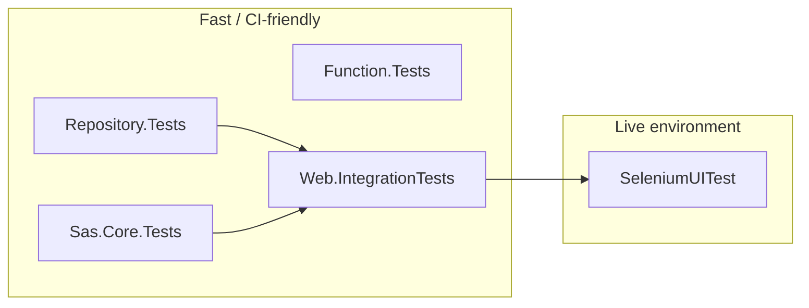
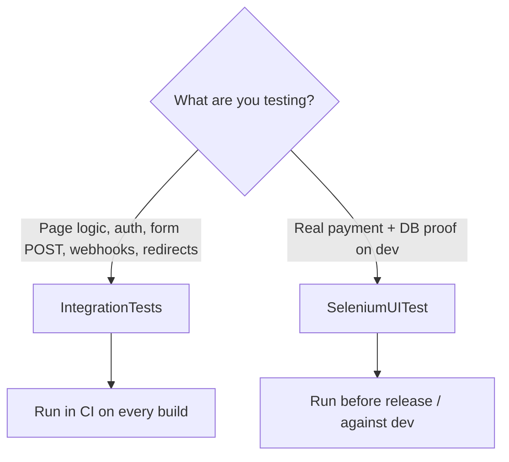

# Test projects overview

This solution uses several test projects at different layers: fast unit tests near the data layer, integration tests through the real ASP.NET pipeline, and browser tests against the dev environment.

## At a glance

| Project | Type | Focus | Approx. tests |
|---------|------|--------|---------------|
| `BancoAlimentar.AlimentaEstaIdeia.Repository.Tests` | Unit | Data access and repository business rules | ~150+ |
| `BancoAlimentar.AlimentaEstaIdeia.Sas.Core.Tests` | Unit | Multi-tenant core, payment builders, middleware | ~13 |
| `BancoAlimentar.AlimentaEstaIdeia.Function.Tests` | Unit | Azure Functions (subscriptions, multibanco reminders) | 11 |
| `BancoAlimentar.AlimentaEstaldeia.Web.IntegrationTests` | Integration | Full web app via in-memory test host | 62 |
| `BancoAlimentar.AlimentaEstaIdeia.Web.SeleniumUITest` | UI (live) | Real browser against **dev** + DB verification | 7 |

**Supporting projects (not test runners):**

- `BancoAlimentar.AlimentaEstaIdeia.Web.TestHost` — `CustomWebApplicationFactory`, seeders, auth helpers (`IdentityAuthTestHelper`), tracked `StubMail` for integration tests
- `BancoAlimentar.AlimentaEstaIdeia.Testing.Common` — HTML form helpers, test Key Vault stub

## How the layers relate



- **Repository** — rules and persistence
- **Sas.Core** — tenant and payment infrastructure
- **Function** — background jobs (subscriptions, payment reminders)
- **Integration** — pages, auth, forms, webhooks, routing
- **Selenium** — real payment flows on dev/staging with SQL verification

---

## Web test projects compared

Integration and Selenium both exercise the **web app from the outside**, but they differ in **how the app runs**, **what they stub**, and **how deep they go into real payments**.

### Quick comparison

| | **Web.IntegrationTests** | **Web.SeleniumUITest** |
|---|--------------------------|-------------------------|
| **What it is** | In-process API/page tests | Full browser UI tests |
| **App host** | `WebApplicationFactory` (`Web.TestHost`) — app runs **inside the test process** | **Deployed dev site** (`https://dev.alimentestaideia.pt`) |
| **Database** | EF **InMemory** (seeded per run) | Real **SQL Server** (staging DB for assertions) |
| **Browser** | None — `HttpClient` + AngleSharp (parse HTML/forms) | **Selenium** + Chrome |
| **Test framework** | xUnit | xUnit |
| **External services** | Stubbed/faked (e.g. `StubMail`, test Key Vault) | Real Easypay, PayPal sandbox, email infra |
| **Speed / CI** | Fast (~seconds), **CI-friendly** | Slow (minutes), needs Chrome + secrets + dev up |
| **Main goal** | Pages, auth, forms, webhooks, routing, basic flows | End-to-end payment + **DB verification** |

### Web.IntegrationTests

Runs the **real ASP.NET pipeline** without starting Kestrel manually or opening a browser.

- Uses `CustomWebApplicationFactory` to boot the app with **InMemory DB** (unique database per test host), test tenant config, and seeded data.
- Sends HTTP requests with `HttpClient`; submits forms via **AngleSharp** (same idea as a browser POST, but no JavaScript execution).
- Can inspect server-side state through DI (`DonationRepository`, `UserManager`, etc.).
- **Does not** call Easypay/PayPal/SMTP for real — those are stubbed or disabled in config.

**Best for:** “Does this page load?”, “Does login work?”, “Does the donation form POST create a donation and redirect to `/Payment`?”, Easypay webhook handling, admin/auth guards, claim-invoice page behavior.

**Not good for:** JavaScript-heavy UI, third-party payment iframes, or “did Easypay actually charge the card?”

### Web.SeleniumUITest

Drives a **real Chrome browser** against the **live dev environment**. This is the **only live browser suite** — the former Playwright `EndToEndTests` project was removed because it duplicated the same PayPal / credit card / MBWay flows with weaker assertions.

- Base URL: `https://dev.alimentestaideia.pt` (with verification against staging SQL).
- Clicks through donation, payment method selection, Easypay/PayPal/MBWay/Multibanco UIs.
- After the flow, **queries SQL Server** to confirm donation/payment/invoice rows (strongest “did it really persist?” checks).
- Requires **user secrets**: site login, verification connection string, PayPal sandbox credentials, etc.

**Best for:** Full payment journeys, subscription donation (authenticated), claim-invoice with real invoice generation, regressions that only show up with real JS and payment providers.

**Trade-offs:** Flaky/slow, environment-dependent, not ideal for every CI run without dev infra and secrets.

### When to use which



**Rule of thumb:**

- **Integration** — default for new web features; fast feedback in CI.
- **Selenium** — when you must prove **real payments + database** on dev.

---

## Running tests

```bash
# Unit — repositories
dotnet test BancoAlimentar.AlimentaEstaIdeia.Repository.Tests\BancoAlimentar.AlimentaEstaIdeia.Repository.Tests.csproj

# Unit — Sas.Core
dotnet test BancoAlimentar.AlimentaEstaIdeia.Sas.Core.Tests\BancoAlimentar.AlimentaEstaIdeia.Sas.Core.Tests.csproj

# Unit — Azure Functions
dotnet test BancoAlimentar.AlimentaEstaIdeia.Function.Tests\BancoAlimentar.AlimentaEstaIdeia.Function.Tests.csproj

# Integration — in-memory web host
dotnet test BancoAlimentar.AlimentaEstaldeia.Web.IntegrationTests\BancoAlimentar.AlimentaEstaldeia.Web.Integration.Tests.csproj

# UI — requires dev site + user secrets (see project README / appsettings)
dotnet test BancoAlimentar.AlimentaEstaIdeia.Web.SeleniumUITest\BancoAlimentar.AlimentaEstaIdeia.Web.Selenium.UITest.csproj
```

GitHub Actions (`.github/workflows/alimentestaideia.yaml`) runs Repository, Sas.Core, Integration, and Function tests on each build — not Selenium.

---

## 1. Repository.Tests

**Focus:** Repository and validation logic in isolation, using EF InMemory and seeded data (`ServicesFixture`).

| Area | What is covered |
|------|-----------------|
| **Donation** | Payments (credit card, MBWay, Multibanco, PayPal token updates), completion flows, totals/caches, clone/delete, claim-to-user, subscription keys |
| **Invoice** | Find/create by public id, canceled/invalid NIF, idempotency, user invoice lists, `FixConfirmedPayment` repair, missing confirmed payment |
| **Subscription** | Create/sync from EasyPay, capture, donations linked to subscription, delete |
| **Referral** | Codes, campaigns, paid totals, top list, ownership |
| **Campaign** | Current/default campaign resolution |
| **User** | Profile and address updates |
| **Payment notification** | Email notification tracking, Multibanco reminder window |
| **Product catalogue / Donation items** | Catalogue reads, donation line items |
| **Food bank** | CRUD basics |
| **NIF validator** | Portuguese tax number validation API wrapper |

This is the deepest layer: fast, no HTTP, high coverage of donation/payment/invoice rules.

---

## 2. Sas.Core.Tests

**Focus:** Shared multi-tenant infrastructure — tenants, naming, payment client builders.

| Area | What is covered |
|------|-----------------|
| **EasyPayBuilder** | Shared vs per–food-bank payment processor; session requirements |
| **PayPalBuilder** | Same patterns for PayPal client setup |
| **Tenant middleware** | `DoarTenantMiddleware`, tenant provider resolution |
| **Naming strategies** | Domain and path-based tenant routing |
| **Tenant configuration** | Integration smoke via `CustomWebApplicationFactory` |

---

## 3. Function.Tests

**Focus:** Azure Functions that affect subscriptions and multibanco reminders.

| Area | What is covered |
|------|-----------------|
| **MultiBancoPaymentNotificationFunction** | Calls configured reminder URL for pending payments; completes when none pending |
| **DeleteOldSubscriptionFunction** | Deletes expired `Created` subscriptions, preserves initial donation when an active sibling exists, skips active subscriptions, `DeleteDonation` cleanup |
| **UpdateSubscriptionsFunction** | Smoke test, active subscriptions present, idempotent repeated runs (current implementation is transaction-only) |

---

## 4. Web.IntegrationTests

**Focus:** HTTP and Razor Pages through the real app pipeline, with InMemory DB and no external payment or email.

| Area | What is covered |
|------|-----------------|
| **Basic smoke** | Home, Donation, Maintenance, Identity pages return 200 |
| **Donation flow** | Anonymous donate with/without receipt, referral code, validation, maintenance redirect |
| **Referral landing** | Invalid code shows inactive message; valid code redirects to donation |
| **Subscription donation** | Authenticated user starts subscription checkout via stub Easypay |
| **Payment flow** | Webhook completes donation → Payment redirects to Thanks (with Thanks page content); PayPal (start + capture), MBWay (POST + waiting page GET), Multibanco (POST + reference page GET), and credit-card checkout via stub APIs |
| **Webhooks** | Easypay payment (CC, MB, MBWay), generic notifications, unknown payment/donation 404, malformed JSON 400, subscription create/capture/recurring, legacy multibanco reminder idempotency, invoice email idempotency |
| **Account** | Register, email confirm, login (happy path); login failures (wrong password, unconfirmed email); register validation (weak password, duplicate email); forgot password (confirmed user sends mail, unknown user, unconfirmed note); reset password and login with new password |
| **Claim invoice** | GET form, existing/canceled invoice, POST claim (stub mail), invalid NIF, unknown public id |
| **Admin** | Unauthenticated redirect; admin GET/POST reload settings (cache clear confirmation) |
| **Subscriptions** | Auth redirect; authenticated subscriptions page; owner POST cancel/delete with stub Easypay |

Bridges repository logic and user-facing pages without hitting dev or real Easypay/PayPal.

---

## Code coverage (CI)

GitHub Actions collects Cobertura reports using `coverlet.runsettings` at the repository root. The settings:

- **Include** only `BancoAlimentar.AlimentaEstaIdeia.*` production assemblies
- **Exclude** `*.Tests` projects and `*.Integration.Tests`
- **ExcludeByFile** EF migrations and `*Designer.cs`

Download the **code-coverage** artifact from a workflow run to inspect per-assembly numbers without test-project noise. Visual Studio solution-wide totals still mix in Web Razor Pages and migrations unless you filter the report the same way.

---

## 5. Web.SeleniumUITest

**Focus:** Real Chrome against `https://dev.alimentestaideia.pt`, with SQL verification on the staging database.

| Area | What is covered |
|------|-----------------|
| **Payments** | Visa (Easypay), PayPal sandbox, Multibanco, MBWay (with/without receipt) |
| **Subscriptions** | Authenticated subscription donation (requires test credentials) |
| **Claim invoice** | Full UI flow and invoice persisted in DB |

**Requirements:** user secrets such as `SeleniumTest:Site:Username` / `Password`, verification connection string, PayPal sandbox credentials. Slowest and most environment-dependent suite. Run via `azure-pipeline-selenium-ui-tests.yml` or locally before release.

---

## Related documentation

- [Payments — how to test while developing](Documentation/Payments-How-to-Test-while-Developing.md)
- [Penetration test setup](Documentation/Penetration-Test-Setup/)
