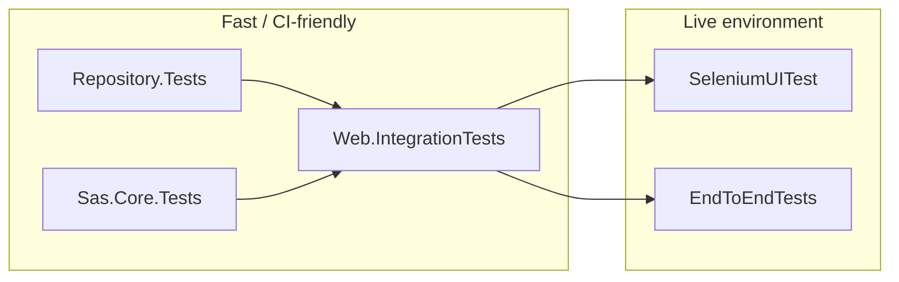
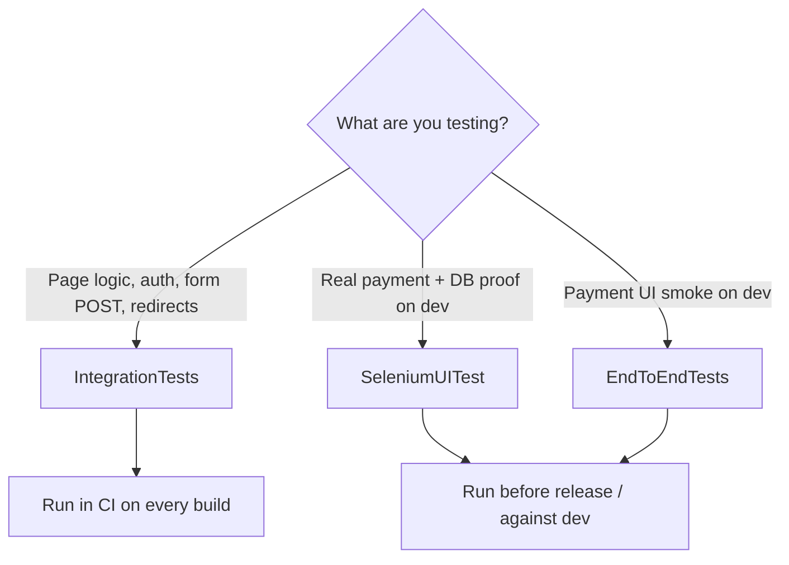

# Test projects overview

This solution uses several test projects at different layers: fast unit tests near the data layer, integration tests through the real ASP.NET pipeline, and browser tests against the dev environment.

## At a glance

| Project | Type | Focus | Approx. tests |
|---------|------|--------|---------------|
| `BancoAlimentar.AlimentaEstaIdeia.Repository.Tests` | Unit | Data access and repository business rules | ~150+ |
| `BancoAlimentar.AlimentaEstaIdeia.Sas.Core.Tests` | Unit | Multi-tenant core, payment builders, middleware | ~13 |
| `BancoAlimentar.AlimentaEstaldeia.Web.IntegrationTests` | Integration | Full web app via in-memory test host | 22 |
| `BancoAlimentar.AlimentaEstaIdeia.Web.SeleniumUITest` | UI (live) | Real browser against **dev** + DB verification | 7 |
| `BancoAlimentar.AlimentaEstaIdeia.Web.EndToEndTests` | E2E (live) | Playwright against **dev** | 3 (+ data rows) |

**Supporting projects (not test runners):**

- `BancoAlimentar.AlimentaEstaIdeia.Web.TestHost` — `CustomWebApplicationFactory`, seeders, auth helpers, stub mail for integration tests
- `BancoAlimentar.AlimentaEstaIdeia.Testing.Common` — HTML form helpers, test Key Vault stub

## How the layers relate



- **Repository** — rules and persistence
- **Sas.Core** — tenant and payment infrastructure
- **Integration** — pages, auth, forms, routing
- **Selenium / Playwright** — real payment flows on dev/staging

---

## Web test projects compared

Integration, Selenium, and EndToEnd all exercise the **web app from the outside**, but they differ in **how the app runs**, **what they stub**, and **how deep they go into real payments**.

### Quick comparison

| | **Web.IntegrationTests** | **Web.SeleniumUITest** | **Web.EndToEndTests** |
|---|--------------------------|-------------------------|------------------------|
| **What it is** | In-process API/page tests | Full browser UI tests | Full browser UI tests |
| **App host** | `WebApplicationFactory` (`Web.TestHost`) — app runs **inside the test process** | **Deployed dev site** (`https://dev.alimentestaideia.pt`) | **Deployed dev site** (configurable `BaseUrl`) |
| **Database** | EF **InMemory** (seeded per run) | Real **SQL Server** (staging DB for assertions) | No direct DB access in the project |
| **Browser** | None — `HttpClient` + AngleSharp (parse HTML/forms) | **Selenium** + Chrome | **Playwright** |
| **Test framework** | xUnit | xUnit | MSTest |
| **External services** | Stubbed/faked (e.g. `StubMail`, test Key Vault) | Real Easypay, PayPal sandbox, email infra | Real Easypay, PayPal sandbox |
| **Speed / CI** | Fast (~seconds), **CI-friendly** | Slow (minutes), needs Chrome + secrets + dev up | Slow, needs Playwright browsers + dev up |
| **Main goal** | Pages, auth, forms, routing, basic flows | End-to-end payment + **DB verification** | Payment UI flows (lighter assertions) |

### Web.IntegrationTests

Runs the **real ASP.NET pipeline** without starting Kestrel manually or opening a browser.

- Uses `CustomWebApplicationFactory` to boot the app with **InMemory DB**, test tenant config, and seeded data.
- Sends HTTP requests with `HttpClient`; submits forms via **AngleSharp** (same idea as a browser POST, but no JavaScript execution).
- Can inspect server-side state through DI (`DonationRepository`, `UserManager`, etc.).
- **Does not** call Easypay/PayPal/SMTP for real — those are stubbed or disabled in config.

**Best for:** “Does this page load?”, “Does login work?”, “Does the donation form POST create a donation and redirect to `/Payment`?”, admin/auth guards, claim-invoice page behavior.

**Not good for:** JavaScript-heavy UI, third-party payment iframes, or “did Easypay actually charge the card?”

### Web.SeleniumUITest

Drives a **real Chrome browser** against the **live dev environment**.

- Base URL: `https://dev.alimentestaideia.pt` (with verification against staging SQL).
- Clicks through donation, payment method selection, Easypay/PayPal/MBWay/Multibanco UIs.
- After the flow, **queries SQL Server** to confirm donation/payment/invoice rows (strongest “did it really persist?” checks).
- Requires **user secrets**: site login, verification connection string, PayPal sandbox credentials, etc.

**Best for:** Full payment journeys, subscription donation (authenticated), claim-invoice with real invoice generation, regressions that only show up with real JS and payment providers.

**Trade-offs:** Flaky/slow, environment-dependent, not ideal for every CI run without dev infra and secrets.

### Web.EndToEndTests

Browser-based against **dev**, but a **slimmer Playwright** suite.

- Uses **Playwright + MSTest** (not Selenium, not xUnit).
- Covers donation → payment (PayPal, credit card, MBWay) with `[DataRow]` for with/without invoice.
- Can record **video** on failure; no repository/DB project references — assertions are mostly **URL/navigation**, not DB state.
- `BaseUrl` comes from `appsettings.json` (defaults to dev).

**Best for:** Smoke-testing payment UI paths on dev with a modern browser stack.

**Trade-offs:** Less verification depth than Selenium (no SQL checks in-project); still needs dev + Playwright browsers installed.

### When to use which



**Rule of thumb:**

- **Integration** — default for new web features; fast feedback in CI.
- **Selenium** — when you must prove **real payments + database** on dev.
- **EndToEnd (Playwright)** — lighter browser smoke on dev; overlaps with Selenium but less DB coupling.

There is intentional overlap between Selenium and Playwright (both hit dev and real payment UIs). Integration tests cover a different layer: same app code, but isolated host and faked externals.

---

## Running tests

```bash
# Unit — repositories
dotnet test BancoAlimentar.AlimentaEstaIdeia.Repository.Tests\BancoAlimentar.AlimentaEstaIdeia.Repository.Tests.csproj

# Unit — Sas.Core
dotnet test BancoAlimentar.AlimentaEstaIdeia.Sas.Core.Tests\BancoAlimentar.AlimentaEstaIdeia.Sas.Core.Tests.csproj

# Integration — in-memory web host
dotnet test BancoAlimentar.AlimentaEstaldeia.Web.IntegrationTests\BancoAlimentar.AlimentaEstaldeia.Web.Integration.Tests.csproj

# UI — requires dev site + user secrets (see project README / appsettings)
dotnet test BancoAlimentar.AlimentaEstaIdeia.Web.SeleniumUITest\BancoAlimentar.AlimentaEstaIdeia.Web.Selenium.UITest.csproj

# E2E — Playwright against configured BaseUrl
dotnet test BancoAlimentar.AlimentaEstaIdeia.Web.EndToEndTests\BancoAlimentar.AlimentaEstaIdeia.Web.EndToEndTests.csproj
```

---

## 1. Repository.Tests

**Focus:** Repository and validation logic in isolation, using EF InMemory and seeded data (`ServicesFixture`).

| Area | What is covered |
|------|-----------------|
| **Donation** | Payments (credit card, MBWay, Multibanco), completion flows, totals/caches, clone/delete, claim-to-user, subscription keys |
| **Invoice** | Find/create by public id, canceled/invalid NIF, idempotency, user invoice lists |
| **Subscription** | Create/sync from EasyPay, capture, donations linked to subscription, delete |
| **Referral** | Codes, campaigns, paid totals, top list, ownership |
| **Campaign** | Current/default campaign resolution |
| **User** | Profile and address updates |
| **Payment notification** | Email notification tracking, Multibanco reminder window |
| **Product catalogue / Donation items** | Catalogue reads, donation line items |
| **NIF validator** | Portuguese tax number validation API wrapper |

This is the deepest layer: fast, no HTTP, high coverage of donation/payment/invoice rules.

---

## 2. Sas.Core.Tests

**Focus:** Shared multi-tenant infrastructure — tenants, naming, payment client builders.

| Area | What is covered |
|------|-----------------|
| **EasyPayBuilder** | Shared vs per–food-bank payment processor; session requirements |
| **PayPalBuilder** | Same patterns for PayPal client setup |
| **Tenant middleware** | `DoarTenantMiddleware`, tenant provider resolution |
| **Naming strategies** | Domain and path-based tenant routing |
| **Tenant configuration** | Integration smoke via `CustomWebApplicationFactory` |

---

## 3. Web.IntegrationTests

**Focus:** HTTP and Razor Pages through the real app pipeline, with InMemory DB and no external payment or email.

| Area | What is covered |
|------|-----------------|
| **Basic smoke** | Home, Donation, Maintenance, Identity pages return 200 |
| **Donation flow** | Anonymous donate with/without receipt, validation, maintenance redirect |
| **Account** | Register, email confirm, login |
| **Claim invoice** | GET form, existing invoice, POST claim (stub mail) |
| **Admin** | Unauthenticated redirect; admin can open reload settings |
| **Subscriptions** | Auth redirect; authenticated subscriptions page |

Bridges repository logic and user-facing pages without hitting dev or real Easypay/PayPal.

---

## 4. Web.SeleniumUITest

**Focus:** Real Chrome against `https://dev.alimentestaideia.pt`, with SQL verification on the staging database.

| Area | What is covered |
|------|-----------------|
| **Payments** | Visa (Easypay), PayPal sandbox, Multibanco, MBWay (with/without receipt) |
| **Subscriptions** | Authenticated subscription donation (requires test credentials) |
| **Claim invoice** | Full UI flow and invoice persisted in DB |

**Requirements:** user secrets such as `SeleniumTest:Site:Username` / `Password`, verification connection string, PayPal sandbox credentials. Slowest and most environment-dependent suite.

---

## 5. Web.EndToEndTests

**Focus:** Playwright browser tests against dev (configurable `BaseUrl` in appsettings).

| Area | What is covered |
|------|-----------------|
| **PayPal** | Donation → PayPal sandbox checkout (with/without invoice) |
| **Credit card** | Easypay test card flow |
| **MBWay** | MBWay payment path |

Similar intent to Selenium but uses Playwright/MSTest; also targets live dev, not the in-memory host.

---

## Related documentation

- [Payments — how to test while developing](Documentation/Payments-How-to-Test-while-Developing.md)
- [Penetration test setup](Documentation/Penetration-Test-Setup/)
